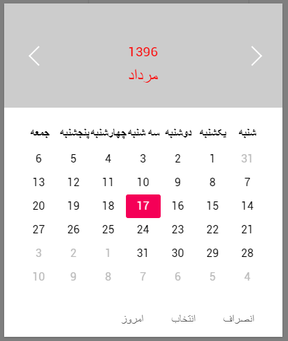

# vue-jalaali-datepicker
Jalaali calendar and datepicker for vue.js 2

# Demo



# Requirements

- [Vue.js](https://github.com/yyx990803/vue) `^2.0.0`
- [moment-jalaali](https://github.com/jalaali/moment-jalaali) `^0.6.0`

# Installation

## npm

```shell
$ npm install vue-jalaali-datepicker
```

# Usage

```html
<script>
// for Vue 2.0
import myDatepicker from 'vue-jalaali-datepicker'
import myDatepicker from 'vue-jalaali-datepicker/vue-jalaali-datepicker-es6' // for ES6

export default {
  data () {
    return {
      myDate: new Date(), // for v-model
      startTime: {
        time: '' // '1396-05-02' (type=day) && '["1396/05/02", "1396/06/02", "1396/07/02"]' (type="multi-day")
      },

      option: {
        type: 'day',
        week: ['شنبه', 'یکشنبه', 'دوشنبه', 'سه شنبه', 'چهارشنبه', 'پنجشنبه', 'جمعه'],
        month: ['فروردین', 'اردیبهشت', 'خرداد', 'تیر', 'مرداد', 'شهریور', 'مهر', 'آبان', 'آذر', 'دی', 'بهمن', 'اسفند'],
        format: 'jYYYY-jMM-jDD',
        placeholder: 'انتخاب کنید',
        inputStyle: {
          'display': 'inline-block',
          'padding': '6px',
          'line-height': '22px',
          'font-size': '16px',
          'border': '2px solid #fff',
          'box-shadow': '0 1px 3px 0 rgba(0, 0, 0, 0.2)',
          'border-radius': '2px',
          'color': '#5F5F5F'
        },
        color: {
          header: '#ccc',
          headerText: '#f00'
        },
        buttons: {
          ok: 'انتخاب',
          cancel: 'انصراف'
        },
        overlayOpacity: 0.5, // 0.5 as default
        dismissible: true // as true as default
      },
      timeoption: {
        type: 'min',
        week: ['شنبه', 'یکشنبه', 'دوشنبه', 'سه شنبه', 'چهارشنبه', 'پنجشنبه', 'جمعه'],
        month: ['فروردین', 'اردیبهشت', 'خرداد', 'تیر', 'مرداد', 'شهریور', 'مهر', 'آبان', 'آذر', 'دی', 'بهمن', 'اسفند'],
        format: 'jYYYY-jMM-jDD HH:mm'
      },
      limit: [{
        type: 'weekday',
        available: [1, 2, 3, 4, 5]
      }]
    }
  },
  components: {
    'date-picker': myDatepicker
  }
}
</script>
<template>
  <div class="card">

    <!-- for Vue 2.0 -->
    <div class="row">
      <span>Departure Date：</span>
      <date-picker v-model="myDate" :date="startTime" :option="option" :limit="limit"></date-picker>
    </div>

  </div>
</template>
```

# API

 - Option

 * type

```
  type: 'day' // 'min', 'multi-day'

```

 * format

```
format: 'jYYYY-jMM-jDD HH:mm'
```

 * placeholder

```
placeholder: 'انتخاب کنید'
```

 * week

```
 week: ['شنبه', 'یکشنبه', 'دوشنبه', 'سه شنبه', 'چهارشنبه', 'پنجشنبه', 'جمعه']
```

 * month

```
  month: ['فروردین', 'اردیبهشت', 'خرداد', 'تیر', 'مرداد', 'شهریور', 'مهر', 'آبان', 'آذر', 'دی', 'بهمن', 'اسفند']
```

* wrapperClass

```
wrapperClass: ''
```

* inputClass

```
inputClass: ''
```
* inputStyle

```
inputStyle: {
  'display': 'inline-block',
  'padding': '6px',
  'line-height': '22px',
  'font-size': '16px',
  'border': '2px solid #fff',
  'box-shadow': '0 1px 3px 0 rgba(0, 0, 0, 0.2)',
  'border-radius': '2px',
  'color': '#5F5F5F'
}
```

 * color

```
  color: {
    header: '#ccc',
    headerText: '#f00'
  }
```


 * buttons

```
buttons: {
  ok: 'انتخاب',
  cancel: 'انصراف'
}
```

 * animate

```
  overlayOpacity: 0.5, // 0.5 as default
  dismissible: true // as true as default
```


 - limit

 * weekdays

```javascript

limit:{
  type: 'weekday',
  available: [1, 2, 3, 4, 5]
}

```

### prop

* Vue 2.0

```javascript
date: {
  time: '' // string
}
```

* v-model should be `Date` and overwrite on date: { time: '' }

```html

<date-picker v-model="myDate" :date="date" :limit="limit"></date-picker>

```


# License

[The MIT License](http://opensource.org/licenses/MIT)
